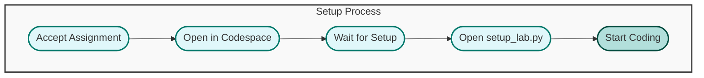
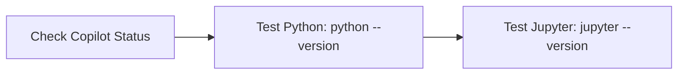
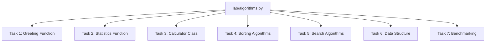

# Setup Lab

Welcome to the Setup Lab! This guide will help you set up your environment, understand the lab structure, and complete your tasks using GitHub Codespaces and Copilot.

---

## 🚀 Quick Start

1. **Accept the GitHub Classroom Assignment**: Click the assignment link from your instructor.
2. **Open in Codespace**: Click the "Code" button and select "Create codespace on main".
3. **Wait for Setup**: Codespace will install all dependencies automatically.
4. **Start Learning**: Open the `lab/algorithms.py` file and begin your work.

---

## 🛠️ Environment Setup

- **GitHub Copilot**: AI-powered code completion and suggestions.
- **Python 3.11**: Latest stable Python version.
- **Jupyter Lab**: Interactive notebook environment (optional).
- **VS Code Extensions**: Python, Jupyter, GitLens, and more.

### Verify Your Setup

1. Ensure Copilot is active (check status bar).
2. Test Python installation: `python --version`.
3. Verify Jupyter: `jupyter --version`.

---

## 📚 Lab Structure

- All code for this lab is in `lab/algorithms.py`.
- Each task is clearly marked with comments and TODOs.
- Use Copilot and VS Code to help you complete each section.

---

## 💡 How to Complete the Lab

1. **Read the comments and TODOs in `algorithms.py`.**
2. **Complete each function or class as described.**
3. **Test your code using the `if __name__ == "__main__":` block at the end of the file.**
4. **Commit your changes with clear messages.**
5. **Push your work to GitHub.**

---

## 📝 Submission Checklist

- [ ] All tasks in `algorithms.py` are completed.
- [ ] Code is tested and runs without errors.
- [ ] Clear and descriptive commit messages.
- [ ] Pushed to your GitHub repository.

---

## 🔧 Troubleshooting & Help

- **Copilot not working?** Make sure you are signed in to GitHub and have access.
- **Import errors?** Run `pip install -r requirements.txt` in the terminal.
- **Kernel issues?** Restart the Jupyter kernel or codespace.
- **Extension problems?** Reload the VS Code window.

If you need help:
- Use the GitHub Issues tab for technical problems.
- Ask questions during office hours.
- Collaborate with classmates (follow academic integrity guidelines).

---

## 🤖 AI Programming Best Practices

- Write clear, descriptive comments.
- Use meaningful variable and function names.
- Provide context through docstrings.
- Break complex problems into smaller parts.
- Review and test AI-generated code before committing.
- Use type hints for better AI suggestions.
- Document your decision-making process.

---

## 🎓 Academic Integrity

- AI tools are learning aids, not replacements for understanding.
- Always review and understand AI-generated code.
- Follow your institution's academic integrity policies.
- Give appropriate attribution when required.

---

**Happy Coding with AI! 🤖✨**
